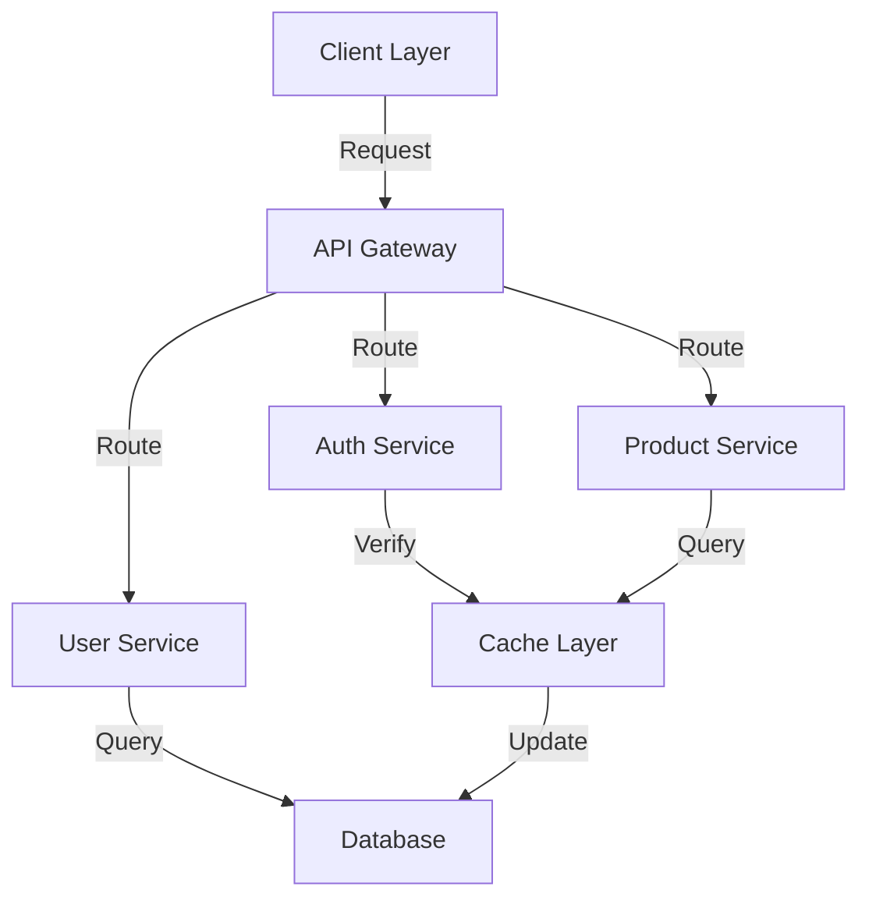

# @deep-thought - Strategic Technical Advisor

Strategic technical advisory and architecture consulting specialist. Deep-Thought brings deep understanding of technology, architecture, and design to solve complex problems and create strategic blueprints for systems and components.

## 🎯 Overview

Deep-Thought is your strategic technical consultant for high-level architectural decisions, system design, and complex problem-solving. Like an oracle who sees the bigger picture, deep-thought provides:

- **Deep Analysis**: Comprehensive examination of systems, requirements, and constraints
- **Strategic Solutions**: Well-reasoned solution plans with architecture overviews
- **Visual Communication**: Mermaid.js diagrams for stakeholder alignment
- **Technology Guidance**: Evidence-based recommendations for tech stack decisions
- **Design Documentation**: Clear documentation of design decisions and trade-offs

## 🚀 Quick Start

### Basic Usage
```bash
# Review and improve current architecture
copilot-cli @deep-thought "Review our current architecture and propose improvements"

# Design new system
copilot-cli @deep-thought "Design a real-time notification system for our platform"

# Solve technical challenge
copilot-cli @deep-thought "Our monolith is hitting scalability limits. Design a path to microservices"
```

### With Specific Context
```bash
# Include folder analysis
copilot-cli @deep-thought "Analyze S:\rc\_priv\commandline-crew architecture and suggest optimizations"

# Complex problem solving
copilot-cli @deep-thought "We need to migrate from SQL to NoSQL. What approach should we take? Consider our current queries and data model"

# Technology selection
copilot-cli @deep-thought "Compare REST vs GraphQL vs gRPC for our API. Provide detailed comparison with diagrams"
```

## 🔍 When to Use @deep-thought

### ✅ Perfect For:
- **Architecture Reviews**: Assessing current system design and identifying improvements
- **System Design**: Creating architecture for new features or systems
- **Technology Decisions**: Evaluating and recommending tech stacks
- **Complex Problem-Solving**: Tackling challenging technical issues
- **Stakeholder Communication**: Creating diagrams and documentation for decision-making
- **Design Trade-offs**: Analyzing pros/cons of different approaches
- **Strategic Planning**: Long-term technical roadmap and evolution path
- **Performance Optimization**: Identifying bottlenecks and proposing solutions

### ❌ Not For:
- Implementing code (use other agents or developers)
- Running tests or linters (use @quality-pal)
- Searching documentation (use @knowledgebase-wizard)
- Executing commands (use agents with execution capabilities)

## 📋 Capabilities

### Deep Analysis
Deep-Thought can:
- Examine system architecture and design patterns
- Analyze codebase organization and structure
- Identify performance bottlenecks and scalability issues
- Assess technology stack suitability
- Evaluate design trade-offs and constraints

### Solution Planning
Deep-Thought produces:
- Comprehensive solution architectures
- Implementation roadmaps with phases
- Technology recommendation reports
- Design pattern analysis and proposals
- Migration strategies and approaches

### Visual Communication
Deep-Thought creates:
- Mermaid.js system architecture diagrams
- Component interaction diagrams
- Data flow diagrams
- Deployment architecture diagrams
- Technology decision trees
- Timeline and roadmap visualizations

### Strategic Consulting
Deep-Thought provides:
- Pros/cons analysis of architectural approaches
- Risk assessment and mitigation strategies
- Performance and scalability analysis
- Security and reliability considerations
- Team skill and maintenance implications

## 📝 Usage Examples

### System Architecture Review

```bash
copilot-cli @deep-thought "Review the commandline-crew project architecture. Analyze the agent system design, suggest improvements for scalability and maintainability. Include mermaid diagrams showing the agent communication patterns."
```

**Expected Output:**
- Current architecture assessment
- Identified strengths and weaknesses
- Mermaid diagrams of agent interactions
- Recommendations for improvement
- Implementation priorities

### Design New Feature

```bash
copilot-cli @deep-thought "Design a caching layer for the knowledgebase-wizard agent. Consider performance, consistency, and memory usage. Provide architecture diagrams and explain trade-offs with implementation estimates."
```

**Expected Output:**
- Caching strategy overview
- Architecture diagrams (mermaid)
- Trade-off analysis
- Implementation approach
- Fallback and invalidation strategies

### Technology Selection

```bash
copilot-cli @deep-thought "We're building a real-time event system. Should we use message queues (RabbitMQ, Kafka) or event streams? Compare approaches with diagrams, pros/cons, and recommendations for our use case."
```

**Expected Output:**
- Technology comparison matrix
- Architecture diagrams for each approach
- Detailed pros/cons
- Recommendation with rationale
- Implementation considerations

### Scalability Consultation

```bash
copilot-cli @deep-thought "Our API is hitting 50k requests/second but can only handle 10k. Design a scalability improvement plan including load balancing, caching, and database optimization. Include architecture diagrams."
```

**Expected Output:**
- Bottleneck analysis
- Tiered improvement plan
- Architecture diagrams before/after
- Technology recommendations
- Implementation phases and effort estimates

### Migration Strategy

```bash
copilot-cli @deep-thought "Design a migration strategy from monolith to microservices. Consider our existing data, team size, and business requirements. Provide a phased approach with diagrams and risk mitigation."
```

**Expected Output:**
- Migration phases overview
- Service decomposition strategy
- Data consistency approach
- Mermaid diagrams of transition states
- Risk assessment and mitigation
- Timeline and dependencies

## 🎨 Diagram Examples

Deep-Thought produces diagrams in Mermaid.js format like:



## 🤝 Working with Stakeholders

Deep-Thought produces documentation suitable for:

- **Engineering Teams**: Technical details, implementation roadmaps, and decision rationale
- **Architects**: High-level design decisions, trade-off analysis, and documentation
- **Product Managers**: Feature impact, timeline estimates, and strategic alignment
- **C-Level/Leadership**: Business implications, ROI, and strategic value
- **Other Agents**: Structured solutions that @orchestrator can decompose for execution

## 🔄 Integration with Other Agents

Deep-Thought works best in combination with:

- **@orchestrator**: Takes deep-thought's solution plan and delegates implementation to other agents
- **@quality-pal**: Validates that implementations match the architectural design
- **@knowledgebase-wizard**: Researches technologies recommended by deep-thought
- **Implementation Agents**: Execute components designed by deep-thought

Example workflow:
```
1. @deep-thought: Design new notification system architecture
2. @orchestrator: Decompose into backend, frontend, and database components
3. @backend-dev: Implement notification service per design
4. @frontend-dev: Implement notification UI per design
5. @quality-pal: Verify implementation matches architecture
```

## 💡 Prompting Tips

### Be Specific About Context
```bash
# ✅ Good
"Review our microservices architecture in src/ folder. We have 50k users and 1k requests/second. Design for 10x growth."

# ❌ Vague
"Make our architecture better"
```

### Include Constraints and Requirements
```bash
# ✅ Good
"Design a real-time dashboard. Constraints: React frontend, Node.js backend, PostgreSQL, team of 3, budget $50k, 6-month timeline"

# ❌ Missing Context
"Design a real-time dashboard"
```

### Ask for Specific Deliverables
```bash
# ✅ Clear
"Provide: 1) Architecture diagram 2) Technology comparison table 3) Migration roadmap 4) Risk assessment"

# ❌ Open-ended
"Tell me about the architecture"
```

### Include Existing Information
```bash
# ✅ Helpful
"We currently use REST APIs with 200ms avg response time. Goal: <50ms. Design optimization strategy"

# ❌ Missing Baseline
"Make our APIs faster"
```

## 🎓 What Deep-Thought Delivers

### 1. Architecture Diagrams
- System overview with components
- Data flow and communication patterns
- Deployment topology
- Technology stack illustration

### 2. Design Documentation
- Solution architecture overview
- Component responsibilities and interfaces
- Technology justifications
- Trade-off analysis

### 3. Implementation Strategy
- Phased rollout approach
- Dependencies and sequencing
- Risk mitigation plans
- Success metrics

### 4. Decision Records
- Architectural Decision Records (ADRs)
- Trade-off analysis
- Alternative approaches considered
- Rationale and long-term implications

### 5. Recommendations
- Technology stack suggestions
- Pattern recommendations
- Best practices aligned to your needs
- Cost/benefit analysis

## ❓ FAQ

**Q: Can deep-thought implement the solution?**
A: No, deep-thought specializes in strategy and design. For implementation, use other agents or developers. Deep-Thought's designs are precise enough to guide implementation.

**Q: Does deep-thought review existing code?**
A: Deep-Thought focuses on architectural and design aspects rather than code-level details. Use @quality-pal for code review. Deep-Thought reviews system design and architecture.

**Q: Can deep-thought research technologies?**
A: Deep-Thought can recommend technologies based on deep technical knowledge. For detailed research on specific libraries, use @knowledgebase-wizard.

**Q: How detailed should my requests be?**
A: The more context you provide (current state, constraints, requirements, timeline, team size), the better deep-thought's recommendations. But start simple—deep-thought will ask clarifying questions.

**Q: Can deep-thought create multiple versions?**
A: Yes! Ask deep-thought to "Compare approach A vs approach B" or "Provide 2-3 different architecture options" for decision-making.

**Q: How do I present deep-thought's recommendations?**
A: Deep-Thought's diagrams and documentation are presentation-ready. Export mermaid diagrams as images and use the structured analysis for decision meetings.

## 🔗 Related Documentation

- **README.md** - Agent system overview
- **agents.md** - Agent framework and guidelines
- **quality-pal.md** - Code quality specialist
- **knowledgebase-wizard.md** - Documentation research specialist

## 📞 Getting Help

If deep-thought's response doesn't meet your needs:

1. **Provide more context**: Constraints, current state, business requirements
2. **Ask for alternatives**: "Compare 3 different approaches"
3. **Request specific format**: "Include Mermaid diagrams and a decision matrix"
4. **Break down complexity**: Ask for components separately, then integration
5. **Iterate**: Use follow-up questions to refine the architecture

---

**Created:** January 19, 2026  
**Agent Type:** Strategic Technical Advisor  
**Primary Mode:** Consultation and Design  
**Integration:** Works with @orchestrator for implementation coordination
